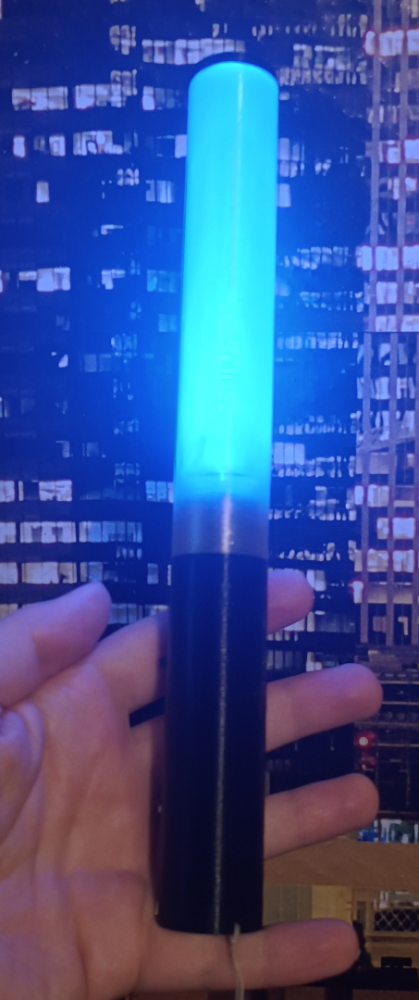

# Future Gadget #16: Luminous Rhythm Emitter
## DIY Penlight project
### Description
This project is a work in progress! Use and build at your own risk! No guarantees given. Parts of the current version may be untested.
This project aims to create an open-source homemade penlight for various concerts (J-Pop, Idols, VTuber, Vocaloid) that can be controlled remotely. You'll need access to a 3D printer and equipment for soldering SMD parts. You'll have to order a PCB, based on the KiCad design provided in the `Circuits` folder, as well as some electronic parts. The `3D` folder contains the stl files for 3D printing. A parts list will be located in the `Circuits` folder.

### Current Features
- Rechargable via USB-C
- Manual selection of LED color by pressing the button (cycling though a preset with 12 colors)
- Setting the color via (unsecured) Bluetooth Low Energy
- Separate Power Off switch

### Shoutouts
Shoutouts to:
- rico132 (for helping with Fusion 360 and helping in fixing electronics)
- CaptainMeow (for the Otomo drawing on the PCB design)
- Dominik K (brainstormed the idea with me)
- KFP & the general VTubing community 